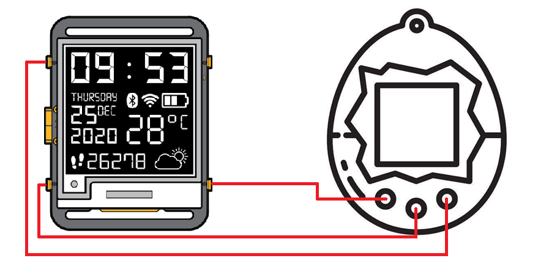

# TamaWatchy

### [**Buy Watchy!**](https://shop.sqfmi.com/products/watchy-kit)

## Overview
This is a Tamagotchi emulator firmware for [Watchy](https://watchy.sqfmi.com). It uses [TamaLIB](https://github.com/jcrona/tamalib) for the core system emulation and can emulate the original Tamagotchi P1/P2.

To maximize battery life, the emulator features an intelligent deep-sleep cycle. The Watchy goes into deep sleep after a few seconds of inactivity. During deep sleep, the state is securely held in RTC RAM (or NVS flash). When a button is pressed or the periodic timer wakes the device, the emulator reliably restores state and "fast-forwards" the core engine to catch up mathematically to the current exact time without user intervention—bringing the pet back to life smoothly.

## Quick Start
1. Download the firmware binary [tamawatchy.bin](https://github.com/sqfmi/tamawatchy/raw/refs/heads/main/tamawatchy.bin)
2. Put your Watchy into bootloader mode
3. Use [esptool web](https://espressif.github.io/esptool-js/) (or esptool.py if you have it locally installed) and flash the firmware to 0x0000
4. Reset and have fun!
   
*Note: Currently only Watchy V3 is supported*

## Buttons

## Code Structure
The project is organized circularly to isolate specific systems (display, power, storage, input).

- **`tama.ino`** - The primary Arduino sketch. Hands initialization, ROM loading, evaluating the deep-sleep wake cause, and driving the interactive loop.
- **`config.h`** - The centralized configuration file with hardware pinouts, deep sleep intervals, LCD scaling calculations, and feature toggles.
- **`tama_hal.cpp` & `.h`** - The Hardware Abstraction Layer bridging TamaLIB's generic device callbacks (button polling, screen memory updates) into ESP32S3's hardware interactions.
- **`tama_display.cpp` & `.h`** - Manages translating the default 32x16 Tamagotchi LCD to a scaled output on Watchy's 200x200 e-ink display. Handles full & partial e-ink panel refreshes.
- **`tama_power.cpp` & `.h`** - Coordinates the deep sleep logic, hardware time synchronization (RTC to ESP32), and the extremely fast ROM catch-up sequence upon waking.
- **`tama_nvs.cpp` & `.h`** - Handles saving and loading the intricate CPU/Memory state of the emulator into fast RTC Memory or reliable flash NVS.
- **`tama_sleep_screen.cpp` & `.h`** - Generates the static minimal-power clock-screen drawn to the E-Ink display right before entering long deep sleep periods.
- **`*-wrapper.cpp`** - C++ compiler bridges used to process the underlying C code of the TamaLIB library dependency.
- **`icons.h` / `tama_font.h`** - Statically encoded bitmaps for the screen icons and system fonts.

## Configuration Options
`config.h` controls nearly every parameter of the device. Important sections include:

- **Emulator Settings:** (`TAMA_DISPLAY_FRAMERATE`, `TAMA_TIMESTAMP_FREQ`) Defines emulator update speeds. `TAMA_SCREEN_MIN_MS` manages the limits of the e-ink refresh capabilities to prevent screen ghosting.
- **Display Scaling:** Controls `PIXEL_SCALE` and placement coordinates (`LCD_OFFSET_X`, `LCD_OFFSET_Y`) to organize the 32x16 emulated matrix onto the center of the display with distinct hardware icons.
- **State Storage Target (`STATE_STORAGE_RTC`):** 
  - `1`: Savestates to the ESP32S3's RTC Slow Memory. This is incredibly fast and avoids flash memory degradation but will be erased if the device loses complete power.
  - `0`: Savestates to standard NVS. Slower and introduces flash wear but entirely permanent.
- **Deep Sleep Thresholds:** `DEEP_SLEEP_INTERVAL_US` defines the length of time the device will sleep before natively waking to update the display's clock. `IDLE_TIMEOUT_MS` mandates how long the device must be inactive before sleeping.

## How it Works
1. **Boot Initialization**: On startup, the system determines the wake cause. The 12-bit ROM is rapidly pushed cleanly from PROGMEM directly into the TamaLIB environment.
2. **State Context Loading**: If waking from deep sleep, the precise CPU counters, flags, and memory variables are rehydrated from NVS or RTC memory.
3. **Time Reconciliation (Fast-Forwarding and RTC Sync)**: Because the generic TamaLIB does not experience time while the Watchy is asleep, the system computes the missing real-time gap. It pushes the ROM clock to process that missing time completely unthrottled without writing frames to the screen, allowing internal events (like growing older, getting hungry) to natively process immediately. Following this fast-forward cycle, the emulator explicitly synchronizes the game's internal clock to Watchy's internal RTC. It achieves this by reading the exact time (hours, minutes, seconds) and writing it directly into the emulated Tamagotchi's RAM.
4. **Interactive Mode**: If woken by a button press, the screen refreshes fully and the program switches into `loop()`. In `loop()`, it monitors for pin interrupts, runs instructions uniformly, and triggers display updates.
5. **Deep Sleep**: Without any registered input for `IDLE_TIMEOUT_MS` the emulator effectively freezes. The system serializes the CPU arrays, triggers the minimal time-only `sleep_screen`, commits properties back to RTC/NVS, and enters deep sleep while holding a wakeup timer matching `DEEP_SLEEP_INTERVAL_US`.
